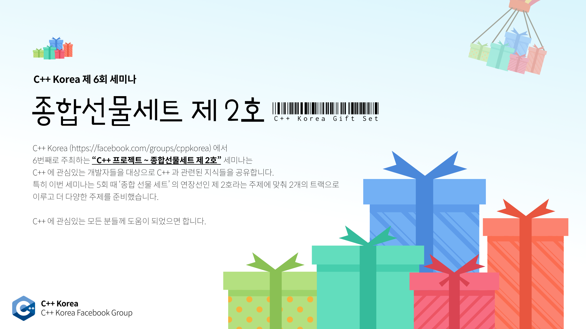

# C++ Korea 제6회 세미나 - "종합 선물 세트 제2호"

###### 2019년 9월 29일에 진행되었던 C++ Korea 6회 세미나 발표 자료 및 예제 코드

C++ Korea(https://www.facebook.com/groups/cppkorea/)에서 6번째로 주최하는 "C++ 프로젝트 ~ 종합 선물 세트 제2호" 세미나는 C++에 관심있는 개발자들을 대상으로 C++와 관련된 지식들을 공유합니다. 이번 세미나는 지난 세미나에 이어 '종합 선물 세트'라는 제목에 맞춰 다양한 주제를 준비했습니다. C++에 관심있는 모든 분들께 도움이 되었으면 합니다.

## 신청 페이지

https://festa.io/events/528

## 프로그램

- 10시 00분 - 10시 30분 (30분) : 세미나 등록
- 10시 30분 - 10시 40분 (10분) : 세미나 소개
- 10시 40분 - 11시 30분 (50분) : 세션 1
- 11시 40분 - 12시 30분 (50분) : 세션 2
- 12시 30분 - 14시 00분 (90분) : 점심 식사
- 14시 00분 - 14시 30분 (30분) : 세션 3
- 14시 40분 - 15시 30분 (50분) : 세션 4
- 15시 50분 - 17시 00분 (70분) : 세션 5
- 17시 00분 - 17시 30분 (30분) : 경품 추첨 및 마무리

## 아젠다 및 발표자 소개

### 트랙 1

#### 세션 1 - 랜덤을 사용하는 우아한 방법

- 내용 : STL의 랜덤 함수군을 쉬운 설명을 통해 설명합니다.

- 강연자 : 제이슨 김
    - 남경기술
    - Microsoft Developer Technologies MVP

#### 세션 2 - C++ 오픈 소스 101

- 내용 : 요즘 Github나 Gitlab을 통해 오픈 소스 프로젝트를 진행하는 분들이 있습니다. C++로 오픈 소스 프로젝트를 진행하고 싶은 분들 역시 존재할 것이라 생각합니다. 유명한 프로젝트를 보면 CI, 코드 품질 체크, 테스트 등이 자동화되어 있는 모습을 볼 수 있습니다. 하지만 C++로 그런 툴들을 붙이는 건 쉽지 않을 뿐더러 자료도 여기저기 나눠져 있습니다. 이번 발표에서는 C++로 오픈 소스를 만들 때 필요한 각종 사항들을 어떻게 적용하는지 예제 프로젝트를 통해 살펴보고자 합니다.

- 강연자 : 옥찬호
    - 넥슨코리아 게임 프로그래머
    - Microsoft Developer Technologies MVP
    - C++ Korea 그룹 관리자
    - 번역서 : 게임샐러드로 코드 한 줄 없이 게임 만들기 (에이콘출판, 2013), 유니티 Shader와 Effect 제작 (에이콘출판, 2014), 2D 게임 프로그래밍 (에이콘출판, 2014), 러스트 핵심 노트 (한빛미디어, 2017), 모던 C++ 입문 (길벗, 2017), C++ 최적화 (한빛미디어, 2019)

#### 세션 3 - `virtual`과 Concepts 비교

- 내용 : C++20 Concepts를 쉽게 이해할 수 있도록 `virtual`과 비교하여 설명합니다. `virtual`과 Concepts 각각의 특징과 접근법 차이를 단순한 예제 코드를 통해서 확인합니다. 상세한 부분에 대해서는 다루지 않기 때문에 모던 C++에 익숙하지 않더라도 `virtual`과 템플릿 코드를 대략적으로나마 이해하고 있다면 어렵지 않게 들을 수 있습니다.

- 강연자 : 박동하
    - Alchera Inc. 전문연구원
    - C++ Korea 운영진

#### 세션 4 - 외계인이 만든 C++ Reference

- 내용 : C++ 포인터만큼이나 어려운 참조(Reference)의 실체를 살펴봅니다. (컴파일러는 참조를 어떻게 기술하는가 / 왜 LValue, RValue Reference를 나누게 되었는가 / 값 반환(Return by Value) 함수는 어떻게 Reference와 연결되는가 / 그 외 참조에 관련된 알유신잡(알아두면 유용한 신비한 잡학사전))

- 강연자 : 김화수
    - Client(Windows) & Server(Linux) 개발자
    - 저서 : [Fundamental C++ 프로그래밍 원리], [기본 개념과 핵심 원리로 배우는 C++ 프로그래밍], [C 언어로 배우는 프로그래밍의 기초]

#### 세션 5 - 채팅 서버 개발로 알아보는 C++의 기능들

- 내용 : 이 발표는 C++를 최소한 책 1권 정도는 본 사람 혹은 C++ 공부를 꾸준히 하고 있지만 C++로 애플리케이션을 어떻게 만드는지 잘 모르는 사람들을 위한 것입니다. C++를 공부하면서 배운 기능들이 어떤 곳에서 어떻게 사용하는지 안다면 공부가 더 재밌고 더 효율적으로 학습할 수 있습니다. 그래서 이 발표에서는 C++로 만든 프로그램을 주제로 하여 C++로 어떻게 만들었는지 설명합니다. C++로 만든 프로그램은 네트워크 프로그래밍인 채팅 서버입니다. 이 프로그램을 만들기 위해 사용된 C++ 기능들에 대해서 하나씩 나열하고, 어떤 이유, 어떤 목적으로 이 기능들을 사용했는지 설명합니다. 그리고 이 발표를 통해서 덤으로 네트워크 서버 프로그래밍에 대해서도 조금이지만 배울 수 있습니다. C++ 표준은 C++17을 기준으로 합니다.

- 강연자 : 최흥배
    - 2003년부터 온라인 게임 서버 개발을 시작하여 온라인 보드 게임, 액션, MMORPG 등 다양한 장르의 게임 개발에 참여했다. 2016, 2017년에는 NHN Next 라는 교육 기관에서 게임 개발 과정의 겸임 교수로 일을 했다. 현재는 컴투스에서 게임 서버 기술 R&D 및 기술 교육 관련 일을 하고 있다.
    - 컴투스 게임 서버 프로그래머
    - Microsoft Developer Technologies MVP
    - '게임 서버 개발자 모임' 운영진(https://www.facebook.com/groups/207844736374114)

### 트랙 2

#### 세션 1 - Strong type in C++

- 내용 : Strong type이 무엇인지 정의하며 왜 필요한지 소개할 것입니다. 다양한 c++ 도구(free function, algebraic data type, etc)들에 strong type을 대입해 강건한 설계, testability 향상 등 다양한 이득을 얻을 수 있음을 보일 예정입니다. 또한 그 이면에 있는 수학적인 의미를 되짚어 보며 한층 더 깊은 내용을 소개하고자 합니다. 마지막으로 strong type의 한계와 현 주소에 대해 알아보며 어떤 시도들이 있는지 알아 보겠습니다.

- 강연자 : 박재영

#### 세션 2 - 천하제일 C++ 최적화 퀴즈 대회

- 내용 : C++ 컴파일러에서 어떤 코드를 뱉고 어떻게 어떤 코드가 빠르게 또는 느리게 작동하는지 퀴즈로 알아보는 시간입니다. 언어 레벨에서 볼 수 있는 쉬운 문제부터, 아키텍처를 정확하게 이해하고 있어야 풀 수 있는 문제까지 다양한 문제들을 만나보실 수 있습니다. 지금 당장 자신이 얼마나 C++을 효율적으로 사용하고 있는지 알아볼까요?

- 강연자 : 주준량
    - Open Source Contributor  
    - .NET Framework Member 
    - Sniper, Co.

#### 세션 3 - C++에서 퍼포먼스 측정하기

- 내용 : 런타임 성능 측정은 소프트웨어의 정량적인 평가를 위해 빠질 수 없는 과정입니다. 그러나 오늘날의 컴퓨터 시스템들은 컴퓨터 아키텍처 레벨부터 시스템 레벨까지 성능 측정을 어렵게 만드는 요소들로 가득합니다. 이 세션에서는 런타임 성능 측정 과정에서 기본적으로 고려해야되는 사실들, cache warm starting, confidence interval 과 같은 기초적인 과정들을 살펴봅니다.

- 강연자 : 김규래
    - 서강대학교 전자공학과
    - 분산시스템 연구실

#### 세션 4 - My Own "Parallel Parser" for "Paradox Game Data"

- 내용 : 패러독스 회사의 대표적인 게임(Clausewitz나 jomini 엔진으로 만든)의 데이터 파일(예 : 세이브 파일)을 병렬 파싱하는 자작 파서(동작 원리, 사용법)를 소개합니다. 데이터 파일 양식은 JSON과 비슷하면서 더 간단합니다. Divide, Partial Lexing(Scanning) or Parsing, Merge라는 메커니즘을 사용합니다. Parsing 전반에 걸쳐서 std::string의 사용을 최대한 뒤로 미루자 라는 생각을 가지고 파서를 제작했습니다. 그 외에도 여러가지 테스트를 하면서, 최대한으로 최적화를 해봤습니다 (최적화하기 전의 코드와 후의 코드를 비교합니다). 끝으로 자작 파서를 사용해서 만든 ClauText(자작언어), ClauExplorer(에디터), ClauSemanticValidator(사용자 정의 함수 + 스키마 체크) 등을 살짝 소개합니다.

- 강연자 : 이동욱
    - 경북대학교 IT대학 컴퓨터학부 졸업
    - 2019년 PDC 세미나 발표
    - Github : vztpv

#### 세션 5 - System API와 Coroutine 결합하기

- 내용 : C++20 Coroutine와 잘 알려진 시스템 API 함수들을 함께 사용하는 방법에 대해서 다룹니다. 발표는 주로 API 함수의 명세(동작)와, 이를 사용한 예제 코드를 분석하는 방식으로 진행됩니다. Coroutine을 사용할때 어떤 부분을 고려해서 코드 구조 설계하는지 설명하고 각각의 한계점에 대해서 짚어 설명합니다.

- 강연자 : 박동하
    - Alchera Inc. 전문연구원
    - C++ Korea 운영진

## 안내

- 본 행사는 사전 등록 하신 분에 한해 참석이 가능합니다.
- 행사 참석을 취소할 경우 1주일 전까지는 전액 환불이 가능하며, 이후에는 환불이 불가능합니다.
- 본 행사는 유료 행사이며, 참가비는 행사 준비 및 진행을 위해 사용될 예정입니다.
- 본 행사를 진행하는 동안 간단한 샌드위치와 다과를 준비할 예정입니다.
- 주차 공간이 제공되지 않으니 근처 유료 주차장에 주차하거나 대중교통을 이용해 주시기 바랍니다.

행사 관련 문의는 utilforever@gmail.com 으로 해주시기 바랍니다.

## 장소

한국마이크로소프트(더케이트윈타워 A동 11층) (주소명 : 서울특별시 종로구 종로1길 50 A동 11층)